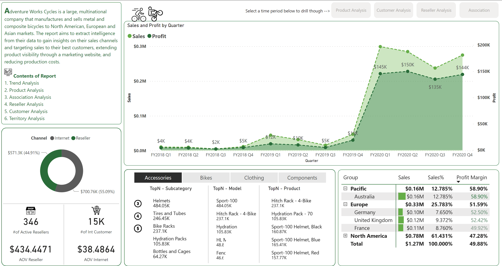
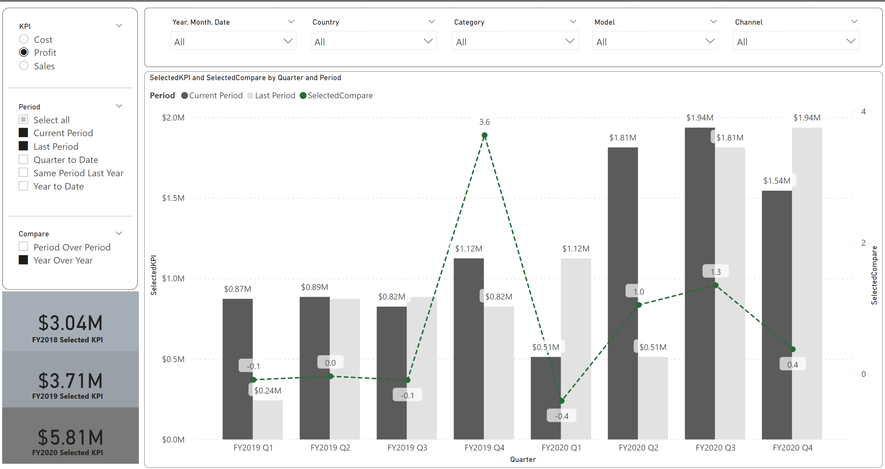
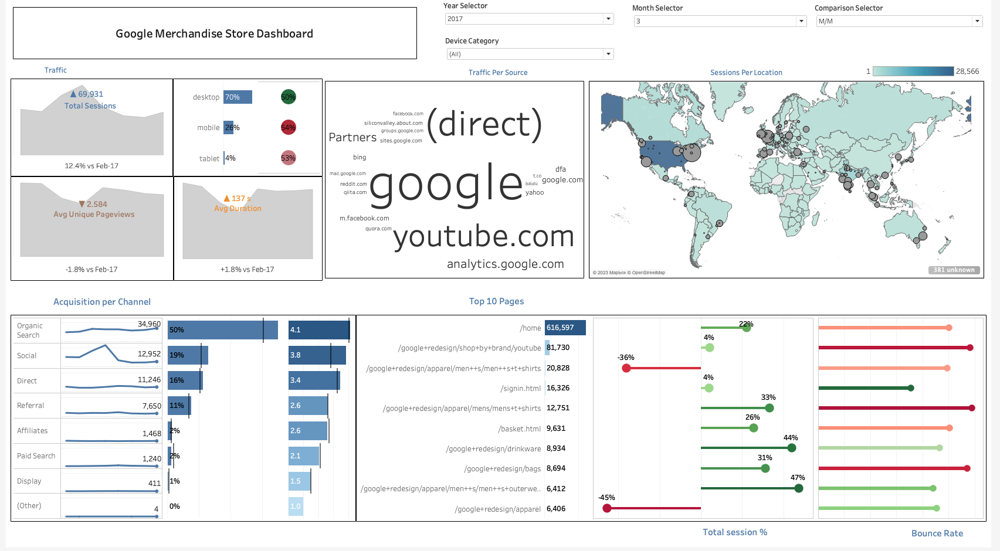
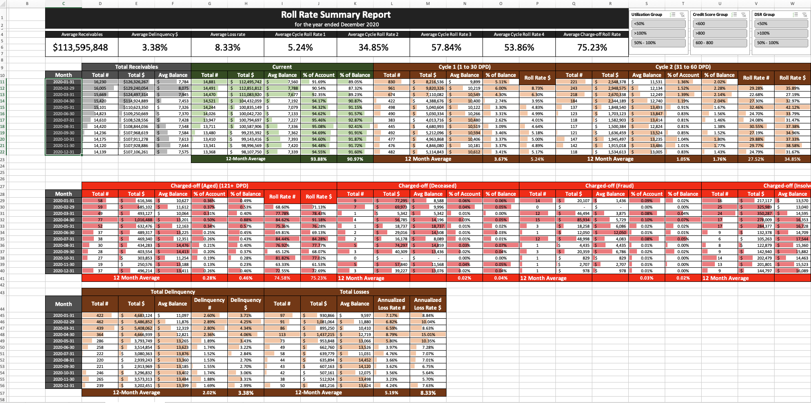
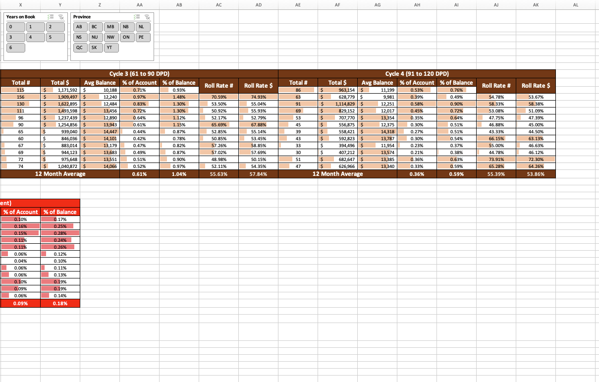

# PROJECTS
---
# RETAIL BUSINESS ANALYSIS

The primary objective is to provide actionable insights to drive strategic decisions that enhance sales performance, optimize product portfolios, and improve customer and reseller relationships. Success is measured by:
- Increased sales and profit margins
- Improved market penetration in underperforming territories
- Enchanced customer satisfaction and retention
- Optimized product mix leading to higher profitability
- Efficient reseller management and performance improvement.

---
# ONLINE SHOPPING BEHAVIOURS 

The project's objective is to improve website traffic and user engagement by developing effective digital marketing campaings and improving website performance. The project aims to achieve the following goals:
- Increase website traffic by 10% in the next six months
- Increase the website's conversion rate by 10% in the next six months
- Improve website load time by 10% in the next six months
- Increase user engagement by 10% in the next six months
  

---
# FINTECH

The Objective of this project is to assess the credit risk of the loan portfolio and make decisions on loan origination and loss provisioning. However, the manual process of generating these reports is time-consuming, error-prone, and lacks flexibility. The project aims to achieve the following goals:
- Develope an automated solution to generate Roll Rate Report, Loss Provisioning Report, and Vintage Analysis Report based on loan data.
- Visualize the loan portfolio performance and credit risk using interactive dashboards and reports.
- Identify the drivers of loan defaults and assess the credit risk of the loan portfolio by segement and vintage

